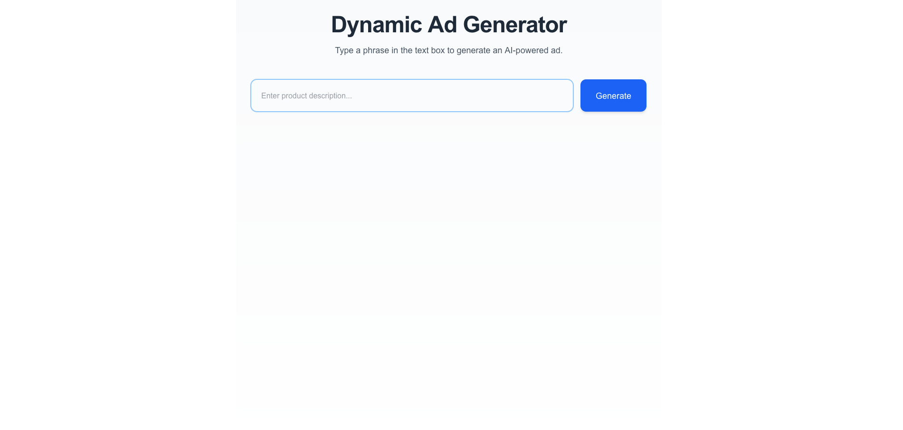

## Dynamic Ad Generator

A concept project that lets you create LLM-generated ads. This project was created to learn more about [StackAdapt](https://www.stackadapt.com/). 

Website: [Demo](https://ad-generator.onrender.com)  

> Note: Please allow up to 30 seconds for the site to load - it's hosted for free. 

---

## Functionality

### 1. Enter your product description
Enter a product or service description and hit the "Generate" or press Enter.

### 2. **View Advertisement**  
The system will generate an advertisement based on your query.

## Technical notes

- Built with Next.js and the OpenAI Assistants API
- Next: Adding additional media types (images and video) to the application.
